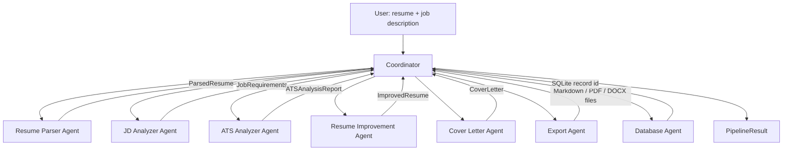

# Architecture

## Overview

The system is a **multi-agent pipeline** built on the OpenAI Agents SDK. A
plain-Python **Coordinator** runs seven specialized components in a fixed
order — each one owns a single responsibility, takes a typed Pydantic model
as input, and returns a typed Pydantic model as output.



## Why a deterministic Coordinator instead of LLM-driven handoffs

The Agents SDK supports LLM-decided handoffs (an agent decides which agent
to call next). This pipeline's steps are not a routing decision — they are
a fixed sequence: you cannot analyze ATS fit before you've parsed the resume
and the job description, and you cannot improve a resume before you know
its gaps. Making that a plain `async` function call chain in
`ats_agents/coordinator.py` gives:

- **Determinism** — the same six steps run in the same order every time.
- **Testability** — each step can be unit tested or mocked independently.
- **Cost/latency control** — no wasted model calls deciding "what's next."

Every individual step still fully uses the SDK's `Agent` + `Runner`
primitives — the coordinator itself is just orchestration.

## Why the score is not computed by an LLM

`services/scoring.py` computes the ATS score, the six-category breakdown,
matched/missing keywords and skills, weak bullet detection, and formatting
issues in **plain, deterministic Python** — not via a model call. A score
that changes between two identical runs would undermine the entire premise
of an "ATS score." The ATS Analyzer Agent (`ats_agents/ats_analyzer.py`)
receives these already-computed numbers and only writes the qualitative
strengths/weaknesses narrative — the part language models are actually good
at.

## Why the folder is `ats_agents/`, not `agents/`

The OpenAI Agents SDK's PyPI package is itself importable as `agents`
(`pip install openai-agents` → `import agents`). A local package also named
`agents` would shadow or collide with that import throughout the codebase.
`ats_agents/` avoids the collision while keeping the same one-module-per-
agent structure.

## Structured output: schema-in-prompt + manual parsing, not `output_type`

The Agents SDK can auto-validate an agent's reply against a Pydantic model
via `Agent(output_type=...)`, using the OpenAI `response_format` /
structured-outputs contract. In practice, several free OpenRouter models
report `structured_outputs` support in their metadata but don't reliably
honor it — they wrap valid JSON in markdown code fences, or emit almost-
valid JSON. The SDK's built-in validator raises immediately on either case.

Instead, `services/llm_client.run_structured()`:

1. Embeds the target JSON Schema directly in the agent's instructions.
2. Runs the agent as a plain-text agent (no `output_type`).
3. Strips markdown fences / extracts the JSON object from the reply.
4. Validates it against the Pydantic model.
5. On failure (bad JSON, schema mismatch, *or* a transient network/response
   error), retries — feeding the exact validation error back to the model
   and asking it to correct itself, up to 3 attempts with backoff.

This trades a small amount of SDK "magic" for reliability against a
free-tier, less-consistent model — while still using `Agent`/`Runner` for
every actual model call.

## Guardrails

`ats_agents/jd_analyzer.py` registers an `InputGuardrail` that rejects a job
description under 50 characters before spending a model call on it —
guards against empty/placeholder input reaching the LLM.

## Data flow / schemas

All cross-agent data contracts live in `models/schemas.py`:

| Model | Produced by | Consumed by |
|---|---|---|
| `ParsedResume` | Resume Parser Agent | ATS Analyzer, Resume Improver, Cover Letter, Export |
| `JobRequirements` | JD Analyzer Agent | ATS Analyzer, Resume Improver, Cover Letter, Export |
| `ATSAnalysisReport` | ATS Analyzer Agent | Resume Improver, Export, Database |
| `ImprovedResume` | Resume Improvement Agent | Export |
| `CoverLetter` | Cover Letter Agent | Export |
| `PipelineResult` | Coordinator | CLI / API caller |
| `AnalysisRecord` | Database Agent | History endpoints |

## Scoring formula

```
ATS Score = Keyword Match   × 30%
          + Skills Match    × 25%
          + Experience      × 20%
          + Project Match   × 10%
          + Education Match × 10%
          + Formatting      ×  5%
```

See `services/scoring.py::compute_ats_score` for the full implementation.

## Persistence

`services/database.py` owns a single SQLite table (`analysis_history`) via
`aiosqlite`. `ats_agents/database_agent.py` is the higher-level interface
the coordinator/CLI/API actually call.

## Entry points

- **CLI** (`main.py`, Typer + Rich): `python main.py analyze`, `python main.py history`
- **API** (`api.py`, FastAPI): `POST /analyze`, `POST /improve`, `POST /cover-letter`, `GET /history`, `GET /report/{id}`

Both entry points call the exact same `ats_agents/*` modules — there is no
duplicated business logic between CLI and API.
